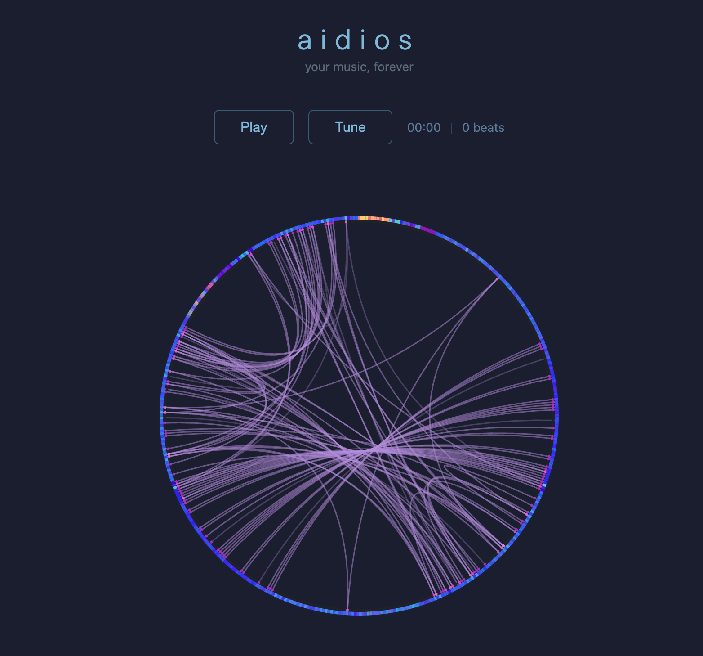

# aidios

**your music, forever**

An open-source recreation of the [Infinite Jukebox](http://infinitejukebox.playlistmachinery.com/) — upload any song and listen to it forever. The app analyzes the audio to detect beats, timbre, and pitch, then builds a graph of similar-sounding beats that it can seamlessly branch between during playback, creating an endless remix.



## How it works

1. **Upload** an audio file (or pick a demo track)
2. **Analysis** extracts beats, tempo, key, timbre (MFCC), and pitch (HPCP) using [essentia.js](https://mtg.github.io/essentia.js/) WASM
3. **Branching graph** connects beats that sound similar, finding transition points where the song can jump without the listener noticing
4. **Infinite playback** follows the beat sequence, probabilistically branching at transition points to create an endless, always-varying remix
5. **Tune** the branch threshold, probability, and transition parameters to shape the remix in real time

## Project structure

```
packages/
  analyzer/    Audio analysis pipeline (beat detection, timbre, pitch extraction)
  jukebox/     Beat-matching algorithm and infinite playback graph
  server/      Hono API server for server-side analysis
  types/       Shared TypeScript type definitions
  web/         Vite frontend — visualization, playback, tuning UI
```

The analyzer uses a **platform facade** so the same DSP pipeline runs on both Node.js (using ffmpeg + CJS essentia.js) and in the browser (using Web Audio API + WASM essentia.js in a Web Worker).

## Getting started

### Prerequisites

- Node.js >= 22
- [ffmpeg](https://ffmpeg.org/) installed and on your PATH (for server-side analysis)

### Install and run

```bash
npm install
npm run dev
```

This starts both the Hono API server (port 3000) and the Vite dev server (port 5173). Open [http://localhost:5173](http://localhost:5173).

### Browser-only mode

To run without the server (analysis happens in-browser via Web Worker):

```bash
VITE_BROWSER_ANALYSIS=true npm run web
```

### Other commands

| Command | Description |
|---|---|
| `npm run dev` | Start server + web concurrently |
| `npm run server` | Start API server only |
| `npm run web` | Start Vite dev server only |
| `npm run analyze` | CLI: analyze an audio file and output JSON |
| `npm run demo` | CLI: analyze + demonstrate infinite beat generation |

## Deployment

The web app can be deployed as a static site (e.g., Vercel, Cloudflare Pages). In production builds, analysis runs entirely in the browser — no server required.

```bash
cd packages/web
npm run build
```

The `dist/` folder is ready to deploy. The app auto-detects whether a server is available and falls back to browser-based analysis.

## Tech stack

- **Frontend**: Vite, vanilla TypeScript, Web Audio API, HTML5 Canvas
- **Backend**: [Hono](https://hono.dev/) (Node.js)
- **Audio analysis**: [essentia.js](https://mtg.github.io/essentia.js/) (C++ Essentia compiled to WASM)
- **Audio decoding**: ffmpeg (server) / Web Audio API (browser)

## License

MIT
