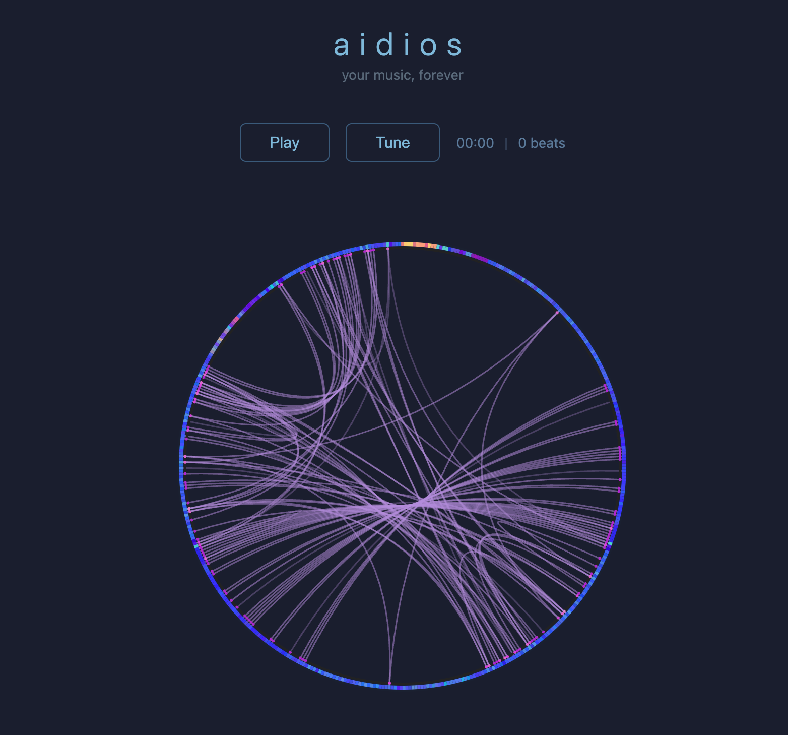

# aidios

**your music, forever**

An open-source recreation of the [Infinite Jukebox](http://infinitejukebox.playlistmachinery.com/) — upload any song and listen to it forever. The app analyzes the audio to detect beats, timbre, and pitch, then builds a graph of similar-sounding beats that it can seamlessly branch between during playback, creating an endless remix.



## How it works

1. **Upload** an audio file, paste a YouTube URL, or pick a demo track
2. **Analysis** extracts beats, tempo, key, timbre (MFCC), and pitch (HPCP) using [essentia.js](https://mtg.github.io/essentia.js/) WASM
3. **Branching graph** connects beats that sound similar, finding transition points where the song can jump without the listener noticing
4. **Infinite playback** follows the beat sequence, probabilistically branching at transition points to create an endless, always-varying remix
5. **Tune** the branch threshold, probability, and transition parameters to shape the remix in real time

## Project structure

```
packages/
  analyzer/    Audio analysis pipeline (beat detection, timbre, pitch extraction)
  jukebox/     Beat-matching algorithm and infinite playback graph
  server/      Hono API server for server-side analysis
  types/       Shared TypeScript type definitions
  web/         Vite frontend — visualization, playback, tuning UI
  ytaudio/     yt-dlp wrapper that streams YouTube audio (Vercel function + dev server)
scripts/
  fetch-yt-dlp.mjs   Downloads the pinned yt-dlp binary into packages/web/bin/
```

The analyzer uses a **platform facade** so the same DSP pipeline runs on both Node.js (using ffmpeg + CJS essentia.js) and in the browser (using Web Audio API + WASM essentia.js in a Web Worker).

## Getting started

### Prerequisites

- Node.js >= 22
- [ffmpeg](https://ffmpeg.org/) installed and on your PATH (for server-side analysis)

### Install and run

```bash
npm install
npm run dev
```

This starts both the Hono API server (port 3000) and the Vite dev server (port 5173). Open [http://localhost:5173](http://localhost:5173).

### YouTube URLs

Pasting a YouTube URL streams the video's best audio track through the backend (`GET /api/youtube?url=...`) and then runs the normal in-browser analysis. The backend shells out to a standalone [yt-dlp](https://github.com/yt-dlp/yt-dlp) binary that `npm run dev` and `npm run build` download automatically via `scripts/fetch-yt-dlp.mjs` (pinned version, SHA-256 verified, gitignored under `packages/web/bin/`). Videos longer than 15 minutes are rejected. Set `YTDLP_PATH` to use a different binary.

Note that downloading YouTube audio is against YouTube's Terms of Service; this is intended for personal use.

### Browser-only mode

To run without the server (analysis happens in-browser via Web Worker):

```bash
VITE_BROWSER_ANALYSIS=true npm run web
```

### Other commands

| Command | Description |
|---|---|
| `npm run dev` | Start server + web concurrently |
| `npm run server` | Start API server only |
| `npm run web` | Start Vite dev server only |
| `npm run analyze` | CLI: analyze an audio file and output JSON |
| `npm run demo` | CLI: analyze + demonstrate infinite beat generation |

## Deployment

The web app can be deployed as a static site (e.g., Vercel, Cloudflare Pages). In production builds, analysis runs entirely in the browser — no server required.

```bash
cd packages/web
npm run build
```

The `dist/` folder is ready to deploy. The app auto-detects whether a server is available and falls back to browser-based analysis.

### Vercel

The YouTube feature runs as a streaming Vercel Function (`packages/web/api/youtube.ts`, config in `packages/web/vercel.json`). It fits the Hobby plan: one function, 300s max duration, no storage. Project settings required:

- **Root Directory**: `packages/web`
- **Node.js Version**: 22.x
- **Include source files outside of the Root Directory in the Build Step**: enabled (the function imports `packages/ytaudio` and the build runs `scripts/fetch-yt-dlp.mjs`)
- **Fluid compute**: on (default)

Optional environment variables for the function:

| Variable | Purpose |
|---|---|
| `YTDLP_COOKIES_B64` | Base64 of a Netscape-format `cookies.txt`; helps when YouTube returns "Sign in to confirm you're not a bot" from datacenter IPs |
| `YTDLP_PROXY` | Passed as `--proxy` |
| `YTDLP_EXTRA_ARGS` | Extra yt-dlp flags, whitespace-separated (e.g. `--extractor-args youtube:player_client=tv`) |
| `YTDLP_MAX_CONCURRENT` | Concurrent downloads per instance (default 2) |
| `YTDLP_TIMEOUT_MS` | Hard kill deadline (default 280000) |

To pick up a new yt-dlp release, bump `YTDLP_VERSION` in `scripts/fetch-yt-dlp.mjs` and redeploy.

#### YouTube's bot wall from Vercel

Measured in September 2026 from Vercel functions in both `iad1` and `sfo1`: YouTube answered `LOGIN_REQUIRED` ("Sign in to confirm you're not a bot") on the player response for 7 of 8 test videos, on every player client tried (`visionos`, `web`, `web_embedded`, `android_vr`, `mweb`, `ios`, `android`). The refusal happens before any proof-of-origin token is consulted, so bundling the bgutil PO token provider (`POT_PROVIDER=1 npm run build`) did not help either. Switching regions did not help. The same binary succeeds on every video from a residential IP.

What does work from a datacenter IP is proving an account or changing the IP:

- `YTDLP_COOKIES_B64`: cookies from a signed-in YouTube session (use a throwaway account; YouTube may flag accounts used from datacenter IPs).
- `YTDLP_PROXY`: a residential or mobile proxy URL.

The function retries with `web_embedded,android_vr` before giving up; `?client=` overrides the chain and `?debug=1` returns the verbose yt-dlp log on errors, which is how the above was diagnosed.

## Tech stack

- **Frontend**: Vite, vanilla TypeScript, Web Audio API, HTML5 Canvas
- **Backend**: [Hono](https://hono.dev/) (Node.js)
- **Audio analysis**: [essentia.js](https://mtg.github.io/essentia.js/) (C++ Essentia compiled to WASM)
- **Audio decoding**: ffmpeg (server) / Web Audio API (browser)

## License

MIT
